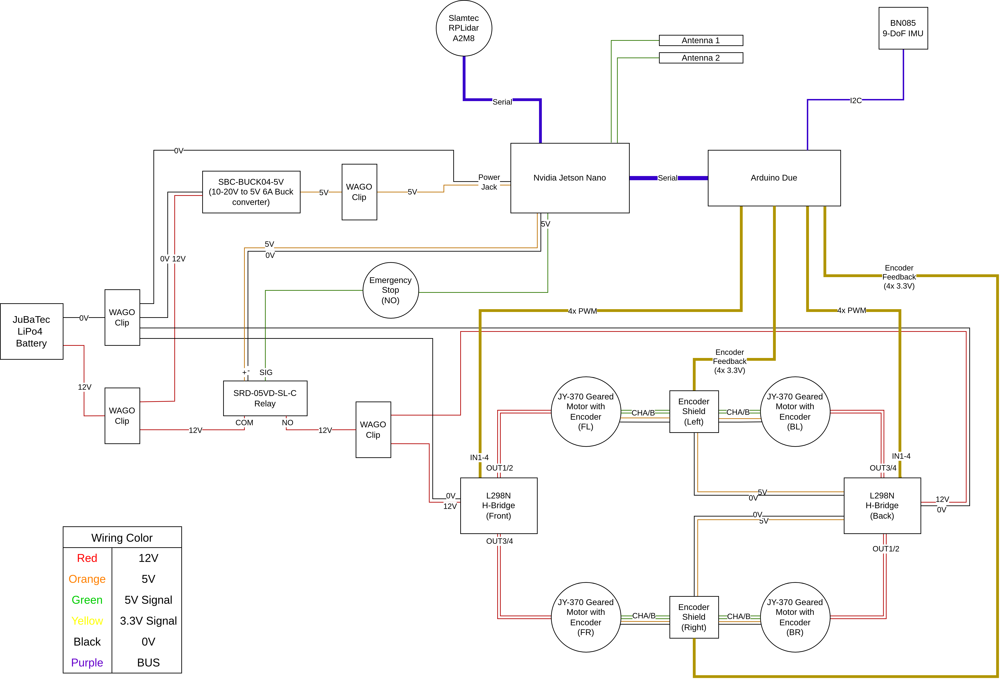
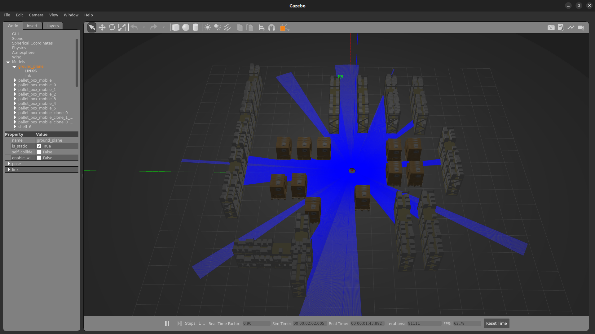
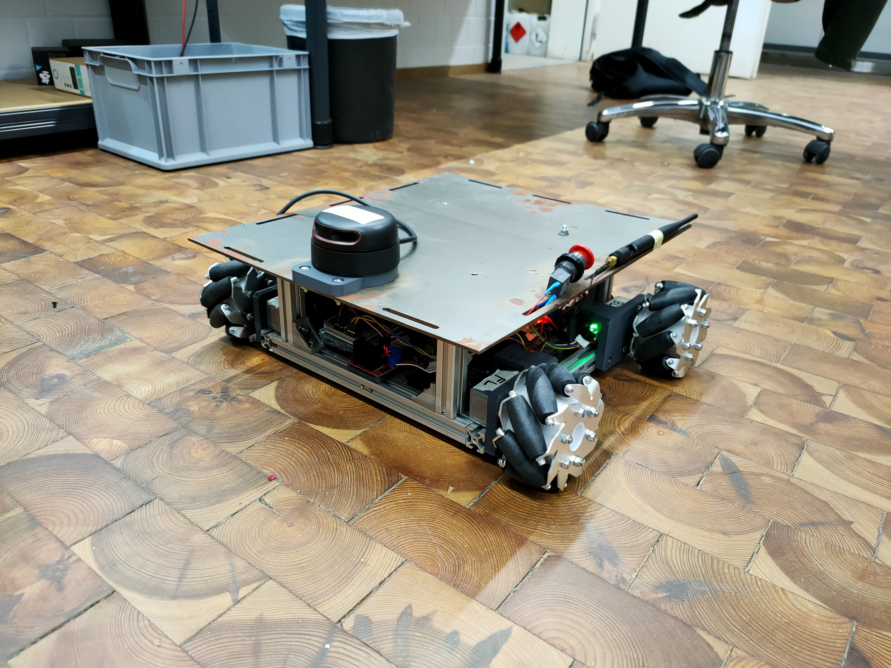

# LCL AGV CONTROL - Nvidia-Jetson-Nano Branch

This repository is part of the semester thesis done by Xun Pua. The goal of the thesis is to develope an Automated Guided Vehicle (AGV) for a modern warehouse environment. The AGV should be able to navigate autonomously in a warehouse environment, perform material handling tasks such as picking up and deliver-ing goods, and communicate with the warehouse management system. It should also be able to avoid obstacles, optimize its path, and adapt to changes in the environment. The design of the AGV should consider various factors such as size, weight capacity, energy consumption, and safety.

This repository contains two branches. One **main** branch and one **nvidia-jetson-nano** branch. The **main** branch is meant to be deployed on the development Laptop. This branch, while also being able to do hardware deployment, is mainly intended for simulation and hardware debugging. The **nvidia-jetson-nano** branch is, as its name suggested, designed for hardware deployment on the Jetson Nano onboard computer. It has a few changes in its docker file and devcontainer to suite the Jetson's ARM64 architecture, and also does not come with the simulation package. It also has extra bind-mounts and libraries for camera deployment, which can only be done on the Jetson. It is therefore important to check which branch you are currently in (see the title) to ensure a some deployment process.

Hardware Demo Video: [AGV_Hardware_Demo_Video](/media/videos/AGV_Hardware_Demo_Video_Xun_Pua_03763640.mp4)

Credits to [Josh Newans](https://github.com/joshnewans) for his [fantastic videos and content](https://www.youtube.com/@ArticulatedRobotics)! Without him, this project would take a lot more time to complete.


## Table of Contents
- [LCL AGV CONTROL - Nvidia-Jetson-Nano Branch](#lcl-agv-control---nvidia-jetson-nano-branch)
  - [Table of Contents](#table-of-contents)
  - [Getting Started](#getting-started)
    - [Starting the Container](#starting-the-container)
  - [SSH](#ssh)
  - [Tests](#tests)
    - [User Interface:](#user-interface)
    - [RPLidar](#rplidar)
    - [Arduino Middleware](#arduino-middleware)
  - [Deployment - Hardware](#deployment---hardware)
    - [Preparations](#preparations)
    - [SLAM](#slam)
    - [AMCL + Navigation](#amcl--navigation)
  - [Packages](#packages)
  - [Some Pictures](#some-pictures)
    - [User Interface](#user-interface-1)
    - [Gazebo Simulation Environment](#gazebo-simulation-environment)
    - [Hardware Assembly](#hardware-assembly)
    - [Hardware AMCL + Navigation](#hardware-amcl--navigation)


## Getting Started
First, assuming you just unpacked the Jetson Nano, we need to install the operating system. The officially supported Ubuntu Version for Jetson Nano is Ubuntu 18.04, which does not support Docker Engine. Luckily, Nvidia Forum Users have released an Image with Ubuntu 20.04. The Bare Image without any extra preinstalled libraries can be found on this [Github Page of Q-engineering](https://github.com/Qengineering/Jetson-Nano-Ubuntu-20-image#bare-image). 

Download the image and install it on the Jetson Nano following this guide: [Get Started with Jetson Nano Developer Kit](https://developer.nvidia.com/embedded/learn/get-started-jetson-nano-devkit). Please also install the wifi module card following this guide: [Jetson Nano + Intel Wifi and Bluetooth](https://jetsonhacks.com/2019/04/08/jetson-nano-intel-wifi-and-bluetooth/)

After installation, start up the jetson either using the power jack or micro-usb port with a connected monitor, keyboard and mouse. The login credentials for the OS are:

> username: jetson \
> password: jetson

Ensure that internet connection is available, either through LAN cable or Wifi.

Firstly, install [Docker Engine](https://docs.docker.com/engine/install/ubuntu/) using any of the official installation methods and also run the [post installation steps](https://docs.docker.com/engine/install/linux-postinstall/) to give Docker sufficient permission. It is possible that Docker is already installed on the OS, but has a lower version. If the lower version Docker is giving build problems for the devcontainer, it is advised to do a clean uninstall of it and reinstall to the newest Docker Engine Version. Also, make sure that VSCode is installed on the Jetson Nano ([Download Link](https://code.visualstudio.com/download#)), and the plugin [**Dev Containers**](https://marketplace.visualstudio.com/items?itemName=ms-vscode-remote.remote-containers) is installed.

Then, clone this repository to you workspace by using:

```
git clone https://gitlab.lrz.de/lpl-tum/students/lcl-agv-control.git
```

In the ros2_ws directory, create the following cache file structure for the colcon build later:

```
├── ros2_ws
│   ├── cache
|   |   ├── humble
|   |   |   ├── build
|   |   |   ├── install
|   |   |   ├── log
│   ├── src
|   |   ├── ...
```
You can also use the following commands:
```
cd ~/lcl-agv-control/ros2_ws/
mkdir cache && cd cache
mkdir humble && cd humble
mkdir build install log
```

### Starting the Container

To start the container, first:
```
cd ~/lcl-agv-control/ros2_ws/src && code .
```

VSCode should open now and prompt you to reopen as container. click yes and the container should start building. Make sure that you have internet connection as the images and packages has to be downloaded. If you don't see the prompt, simply *CTRL + SHIFT + P* and find the *Dev Containers: Rebuild and Reopen as Container* command. After building, you can then use *CTRL + SHIFT + '* to start the bash terminal.

Then, build the ros2 workspace using:
```
cd /home/ros2_ws/
colcon build
```

Do note that it is normal to have warnings for the *mecanumdrive_arduino* on a fresh build. The warnings should not reappear on other consequent builds.


## SSH
To be able to control the AGV Hardware from the development PC, it is required to SSH into the Jetson Nano in wireless mode. For that, the hotspot of the Jetson should first be activated. This can be done for every boot session by typing in the terminal:
```
sudo -H gedit /etc/NetworkManager/system-connections/Hotspot.nmconnection 
```
and setting Autoconnect to true (defaults to false)
```
autoconnect=true
```

Then, install SSH server and set it to autostart on boot by:
```
sudo apt install openssh-server
sudo systemctl enable ssh
sudo ufw allow ssh
sudo update-rc.d ssh defaults  # Autostart SSH on Boot
sudo systemctl start ssh
```

On the development PC, install SSH Client:
```
sudo apt install openssh-client
```

To SSH into the Jetson Nano, first restart the Jetson Nano without any keyboards, mouse or monitor. Then, on the development PC, connect to its hotspot network and run:
```
ssh -XC jetson@10.42.0.1
```

Enter `jetson` as the password and you should now be able to access the Jetson Nano. With this setup, all Graphical Interfaces should be displayed on the development PC. Now, you can start the container in VSCode with the normal procedures show in [Getting Started - Starting the Container](#starting-the-container).


## Tests
Here are some commands to test run tests on individual components

### User Interface:
```
ros2 run ui_package ui_node
```
If run in SSH mode, the UI should appear on the development PC. If not, restart the Jetson Nano (unplug power) without any monitor attached

### RPLidar
Connect the RPLidar to the Jetson Nano via USB. After that, in the container, run:
```
ros2 launch sllidar_ros2 view_sllidar_a2m8_launch.py serial_port:=/dev/serial/by-id/usb-Silicon_Labs_CP2102_USB_to_UART_Bridge_220dbf3dc414304aa791ae01d0dce108-if00-port0 frame_id:=lidar_link inverted:=false
```
You should see the Lidar start spinning and Rviz opening and displaying the 2D point cloud. If you have a different device, you first need to find the device id. For that, run:
```
ls /dev/serial/by-id/...
```
to find the exact path to the device. The device ID is unique and thus can be reused even if multiple devices are connected. 

### Arduino Middleware
To specifically test the communication protocol with the Arduino Due, first connect the Arduino to the Jetson Nano via USB. Note that the Debug Port (Next to the power jack) on the Arduino should be used. Then, in the container, run: 

```
pyserial-miniterm -e /dev/serial/by-id/usb-Arduino__www.arduino.cc__Arduino_Due_Prog._Port_14238313834351619231-if00 57600
```
After connection, you can then use the commands found in [Arduino Communication Protocol](/Arduino/ros_arduino_bridge%20(Due)/README.md) to communicate with the Arduino.

If you have a different device, you first need to find the device id. For that, run:
```
ls /dev/serial/by-id/...
```
to find the exact path to the device. The device ID is unique and thus can be reused even if multiple devices are connected. 

## Deployment - Hardware
### Preparations
Firstly, ensure that the all connections of hardware are connected properly. The electrical architecture of the system is shown as below:



The more detailed connection diagram can be found in the [wiring schematics pdf file](/media/Wiring_Schematics_22_10_2023.pdf)

Make sure that the battery is fully charged before connecting the plus and minus poles to the respective WAGO clips. Disengage the emergency stop button and you should see the LED lights of the green LEDs of the Encoders, The Red LEDs of the H-Bridges, The Arduino Due and the Jetson Nano lighting up. Wait for a few minutes for the Jetson Nano to fully power up. Then, on the development PC, connect to the Hotspot of the Jetson Nano and SSH into it using the last command from the [SSH Section](#ssh). 

### SLAM
To start SLAM on Hardware, run:
```
ros2 launch lcl_agv_pkg hardware_slam.launch.py 
```
This is start the User Interface and RVIZ, which gets displayed on the development PC. The Lidar should start turning on the AGV and after afew seconds, the SLAM map will appear on Rviz. Be aware that after a fresh Container rebuild, The hardware might not launch successfully on the first try. If this happens, simply relaunch.

One issue with this launch is that the error 
```
[slam_toolbox]: Message Filter dropping message: frame 'lidar_link' at time xxx for reason 'discarding message because the queue is full'
```
keeps popping up. Various methods to remove this error from the forum has been tried, sadly with no avail. The error does not impede the functionality of the simulation, but is annoying and spams the terminal with floods of messages.

After the programs have started, you can use the UI to drive the AGV around. The map should update when new areas are visible to the lidar. to save the map, use the panel *SlamToolboxPlugin*, which can be added from *Panels -> Add New Panel*. Specify the **ABSOLUTE PATH** for the file in Save Map and Serialize Map and click the respective buttons to save the map

Be aware that the latency issue of this setup is known, and a fix is under development. For the mean time, **be gentle on the controls** as rapid changes in command might lead to massive hangs or disconnection.

### AMCL + Navigation
To start AMCL and Navigation in the simulation environment, run these commands on three separate terminals. You can specify your own slam_map.yaml (Map created from SLAM) depending on your case. Please wait until one command has successfully started before running the next one:
```
ros2 launch lcl_agv_pkg hardware_amcl_nav.launch.py 
```
```
ros2 launch lcl_agv_pkg localization_launch.py map:=./src/lcl_agv_pkg/maps/slam_map.yaml use_sim_time:=false 
```
```
ros2 launch lcl_agv_pkg navigation_launch.py use_sim_time:=false map_subscribe_transient_local:=true 
```

This is start the User Interface and Rviz. The terminal with AMCL running will then prompt the user to enter a initial position. This can be done by using the *2D Pose Estimate* in Rviz. To guide the robot to a destination, the *2D Goal Pose* function in Rviz can be used. Alternatively for multiple waypoints, the user can activate the *GoalTool* from *nav2_rviz_plugins* and choose waypoint following mode from the *Navigation 2* panel, which can be activated from *Panels -> Add New Panel*.

Be aware that the latency issue of this setup is known, and a fix is under development. For the mean time, be patient when using Rviz, as the program has relatively slow reaction time due to the latency. The diagrams on Rviz also updates relatively slowly.


## Packages
| Package | Description |
|---|---|
| [devcontainer](/ros2_ws/src/.devcontainer/) | Devcontainer and Dockerfile |
| [agv_custom_msgs](/ros2_ws/src/agv_custom_msgs/) | Custom ROS2 Interfaces  |
| [lcl_agv_pkg](/ros2_ws/src/lcl_agv_pkg/) | Main Package |
| [ui_package](/ros2_ws/src/ui_package/) | User Interface |
| [mecanumdrive_arduino](/ros2_ws/src/mecanumdrive_arduino/) | ROS2 Control Hardware Interface ** |
| [serial](/ros2_ws/src/serial/) | Serial Communication Library (Imported) ** |
| [sllidar_ros2](/ros2_ws/src/sllidar_ros2/) | RPLidar Library (Imported) ** |
| [Arduino Code](/Arduino/ros_arduino_bridge%20(Due)/) | Code for Arduino Due |

** Only for Hardware Deployment


## Some Pictures
### User Interface


### Gazebo Simulation Environment


### Hardware Assembly


### Hardware AMCL + Navigation

