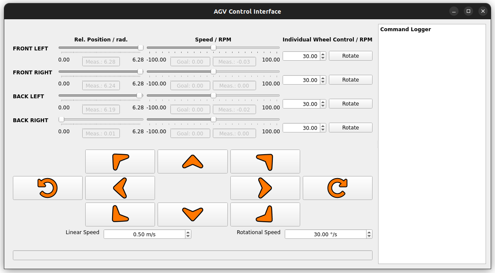

# UI Package
This package contains the `ui_node`, which contains the Qt Application and ROS2 node. The node subscribes to the joint state broadcaster and wheel velocity commands. It publishes single wheel control messages and twist command messages. The UI is built using the PyQt library. User can rotate individual wheels by setting a RPM and pressing rotate. The UI also comes with 10 basic motion buttons for basic maneuvers. The speed of these maneuvers can be set. The UI shows a log of commands sent. It .also shows the current encoder feedback, with relative position and speed in RPM

